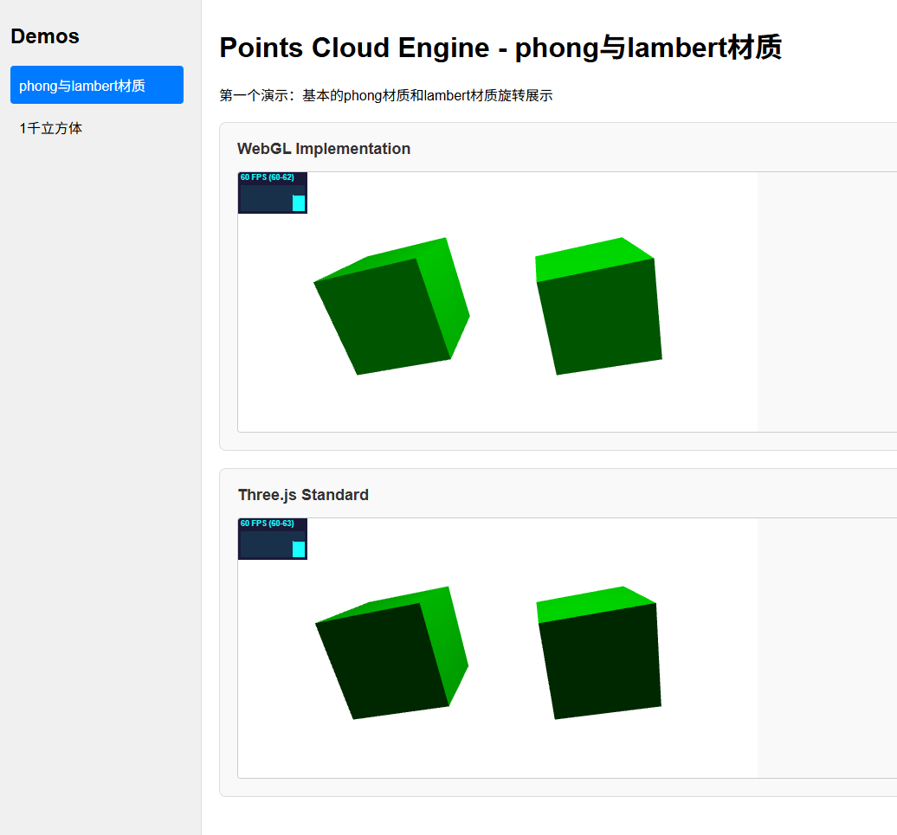
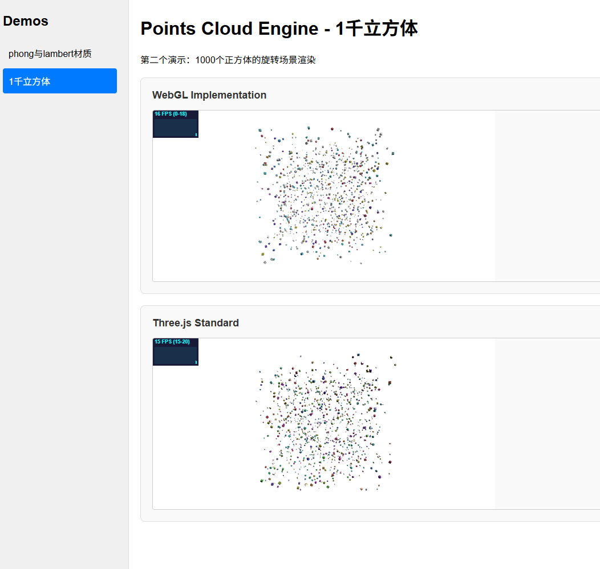

# Points Cloud Engine

一个从零实现的轻量级 WebGL 3D 渲染引擎，参考 Three.js API 设计，用于学习和理解现代图形渲染管线的核心原理。

## 项目简介

Points Cloud Engine 是一个纯手写的 WebGL 渲染引擎，不依赖任何图形库（除了使用 Three.js 作为参考对比）。项目实现了完整的 3D 渲染管线，包括：

- **相机系统**：透视相机（PerspectiveCamera），支持 lookAt、矩阵变换等
- **光照系统**：环境光（AmbientLight）、点光源（PointLight），支持 Phong 和 Lambert 光照模型
- **材质系统**：Phong 材质（MeshPhongMaterial）、Lambert 材质（MeshLambertMaterial）
- **几何体**：立方体（BoxGeometry）等基础几何体
- **场景图**：支持 Group 层级结构和嵌套变换
- **着色器**：手写 GLSL 顶点/片元着色器，支持 MVP 矩阵变换、法线变换、光照计算

## 技术栈

- **语言**：TypeScript 5.9+
- **构建工具**：Vite 8.0+
- **代码规范**：oxlint（语法检查）、oxfmt（代码格式化）
- **开发环境**：Node.js 22.12.0

## 项目结构

```
points-cloud-engine/
├── src/core/           # 核心引擎代码
│   ├── camera/         # 相机系统
│   ├── common/         # 通用工具（颜色、数学、着色器）
│   ├── geometry/       # 几何体
│   ├── group/          # 场景图群组
│   ├── light/          # 光照系统
│   ├── material/       # 材质系统
│   ├── mesh/           # 网格对象
│   ├── renderer/       # WebGL 渲染器
│   └── scene/          # 场景管理
├── example/            # 示例代码
│   ├── demo1/          # 基础示例（Phong/Lambert 材质对比）
│   └── demo2/          # 性能测试（1000个立方体）
└── docs/img/           # 文档图片
```

## 安装方式

### 环境准备

```bash
# 安装 Node.js 22.12.0
nvm install 22.12.0
nvm use 22.12.0

# 配置 npm 镜像（推荐）
npm config set registry https://registry.npmmirror.com/

# 安装 pnpm
npm install pnpm -g
pnpm config set registry https://registry.npmmirror.com/
```

### 安装依赖

```bash
cd points-cloud-engine
pnpm install
```

## 常用命令

### 开发命令

```bash
# 启动示例服务器（推荐）
npm run example

# 开发模式（监听构建）
npm run dev

# 构建项目
npm run build

# 预览构建结果
npm run preview
```

### 代码质量

```bash
# 类型检查
npm run typecheck

# 代码检查
npm run lint

# 自动修复代码问题
npm run lint:fix

# 代码格式化
npm run format

# 检查代码格式
npm run format:check

# 一键修复（格式化 + 自动修复）
npm run fix

# 完整检查（类型检查 + 代码检查 + 格式检查）
npm run check
```

## 示例展示

### Demo 1：材质对比

展示 Phong 材质（高光反射）与 Lambert 材质（漫反射）的效果差异。



### Demo 2：性能测试

渲染 1000 个带独立旋转动画的立方体，测试引擎性能。



## 快速开始

```typescript
import {
  PerspectiveCamera,
  Scene,
  AmbientLight,
  PointLight,
  BoxGeometry,
  MeshPhongMaterial,
  WebGLRenderer,
  Color,
  Mesh,
} from "points-cloud-engine";

// 创建场景
const scene = new Scene();
scene.background = new Color(0xffffffff);

// 创建相机
const camera = new PerspectiveCamera(60, width / height, 0.1, 1000);
camera.position.set(30, 30, 30);
camera.lookAt(0, 0, 0);

// 添加光照
const ambient = new AmbientLight(0x494949);
scene.add(ambient);

const pointLight = new PointLight(0xffffff, 1.5, 0, 0);
pointLight.position.set(50, 50, 50);
scene.add(pointLight);

// 创建网格
const geometry = new BoxGeometry(0.2, 0.2, 0.2);
const material = new MeshPhongMaterial({
  color: 0x00ff00,
  specular: 0xffffff,
  shininess: 30,
});
const mesh = new Mesh(geometry, material);
scene.add(mesh);

// 渲染
const renderer = new WebGLRenderer({ canvas, antialias: true });
renderer.setSize(width, height);

function animate() {
  mesh.rotation.x += 0.01;
  mesh.rotation.y += 0.02;
  renderer.render(scene, camera);
  requestAnimationFrame(animate);
}
animate();
```

## 许可证

MIT
