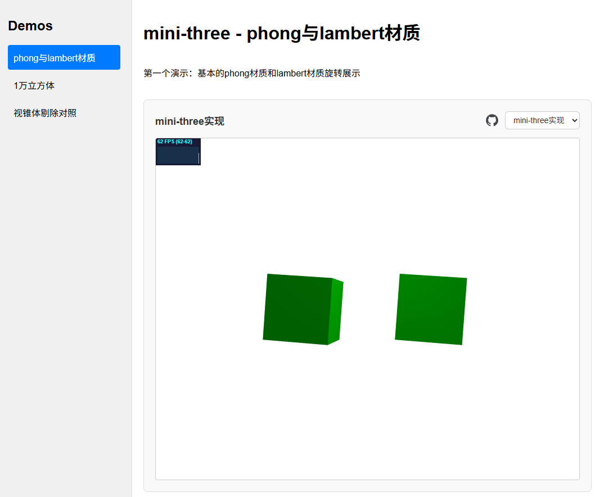
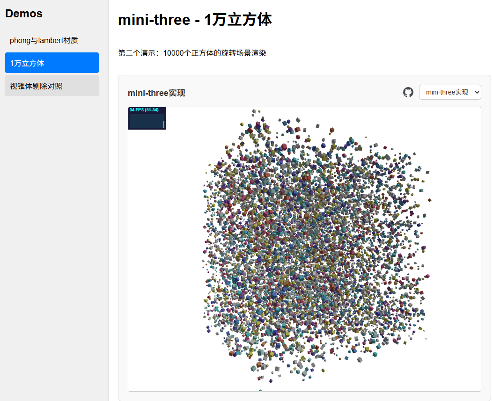
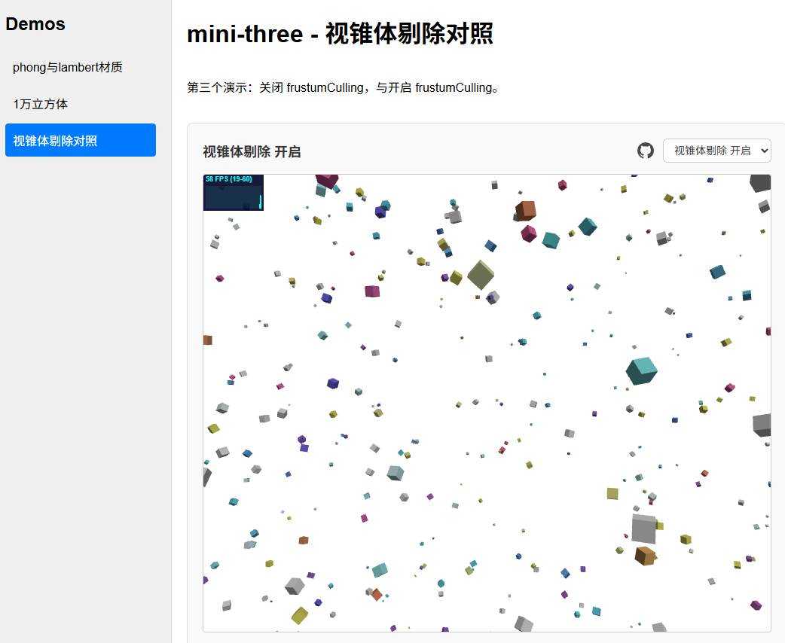

# mini-three

一个从零实现的轻量级 WebGL 3D 渲染引擎，参考 Three.js API 设计，用于学习和理解现代图形渲染管线的核心原理。

## 展示

## 在线演示

示例应用（对应 `apps/example`）：[http://81.71.84.163/](http://81.71.84.163/) — 交互说明见 [docs/demos.md](./docs/demos.md)。

## Monorepo 说明

- 本仓库使用 `pnpm workspace` 管理多包，当前核心包为 `@mini-three/webgl`、`@mini-three/webgpu`、`@mini-three/types`。
- 工作区入口配置见 `pnpm-workspace.yaml`，管理约束见 [docs/monorepo.md](./docs/monorepo.md)。
- 统一提交前检查由根目录 Husky 执行：`pnpm -r run check`。

## 文档

| 文档                                                 | 说明                                              |
| ---------------------------------------------------- | ------------------------------------------------- |
| [docs/getting-started.md](./docs/getting-started.md) | 环境准备、安装依赖、常用命令、仓库目录速览        |
| [docs/quick-start.md](./docs/quick-start.md)         | 最小可运行代码示例                                |
| [docs/demos.md](./docs/demos.md)                     | 示例应用、`demo1`～`demo3` 与各 Demo 底层优化说明 |
| [docs/monorepo.md](./docs/monorepo.md)               | 多包目录、职责、workspace 规则与常用命令          |
| [docs/commit-message.md](./docs/commit-message.md)   | Conventional Commits、`commitlint` 与标题行规范   |

## 项目简介

mini-three 是一个纯手写的 WebGL 渲染引擎，不依赖任何图形库（除了使用 Three.js 作为参考对比）。项目实现了完整的 3D 渲染管线，包括：

- **相机系统**：透视相机（PerspectiveCamera），支持 lookAt、矩阵变换等
- **光照系统**：环境光（AmbientLight）、点光源（PointLight），支持 Phong 和 Lambert 光照模型
- **材质系统**：Phong 材质（MeshPhongMaterial）、Lambert 材质（MeshLambertMaterial）
- **几何体**：立方体（BoxGeometry）等基础几何体
- **场景图**：支持 Group 层级结构和嵌套变换
- **着色器**：手写 GLSL 顶点/片元着色器，支持 MVP 矩阵变换、法线变换、光照计算

## 技术栈

- **语言**：TypeScript 5.9+
- **构建工具**：Vite 8.0+
- **代码规范**：oxlint（语法检查）、oxfmt（代码格式化）
- **开发环境**：Node.js 22.12.0

本地跑示例、看 Demo 与引擎细节，见 [环境与安装](./docs/getting-started.md) 与 [示例与 Demo](./docs/demos.md)。

## 许可证

MIT
